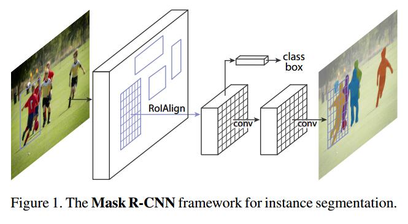
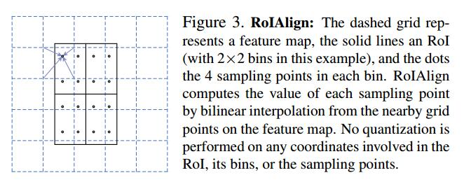

# Mask R-CNN

> Mask R-CNN add a mask branch into Faster-RCNN.

***

### The Detecting Method of Mask R-CNN

There are two stages in Mask R-CNN:

1. [inputs] -> resnet(backbone) -> [c2, c3, c4, c5] -> FPN -> [p2, p3, p4, p5, p6] -> Proposal Header

   -> [classification [batch, height, width, num_anchors, 2], bounding boxes[batch, height, width, num_anchors, 4]]

2. Use nms_limit=6000 and proposal_count=1000 to limit number of proposals, so can accelerate the train  speed. Then get proposals and use roi align to get roi feature.

   [Proposals] -> roi align layer -> [roi feature] -> Refine Layer -> [scores, boxes, classes_id] -> roi align layer -> mask header -> [num_boxes, 28, 28, num_classes]

